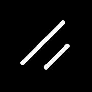

<h1 align="center">Hi 👋, I'm Hridoy Haque</h1>

  I’m a dedicated and detail-oriented Frontend Developer with 3 years of
  hands-on experience, including 2+ years in onsite roles and 1 year as a
  freelance developer. I specialize in crafting modern, responsive, and
  high-performance web applications that deliver exceptional user experiences.
   
  With a strong foundation in JavaScript frameworks like React and Vue.js, I
  bring creativity and precision to every project I work on. My approach
  combines clean code, performance optimization, and user-centric design,
  ensuring that each product is both functional and visually appealing.

---

<h3 align="left">Languages:</h3>

  
  
  

<h3 align="left">Frontend Libraries & Tools:</h3>

  
  
  
  
  
  
  
  
  
  
  
  
  
  
  

<h3 align="left">Backend Frameworks & Tools:</h3>

  
  
  
  
  
  

<h3 align="left">Connect with me:</h3>

  

